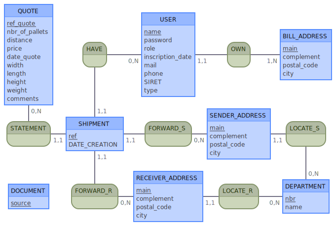

# Cahier des charges fonctionnel

<strong>L'équipe</strong>

**Grégory CARUSO**
- Product Owner
- Lead Dev Front

**Marwann MANSOUR**
- Référent Technique
- GIT Master
- Dev Front

**Edwin GRANZOTTO**
- SCRUM Master
- Dev Back

**Cédric GAUTHIER**
- Lead Dev Back

<strong>Présentation du projet</strong>

Le projet, initié par la Société **TRANSPORTS & DISTRIBUTIONS ROUTIERS (T.D.R.)** a pour objectif de développer la visibilité de l’entreprise par le biais d’un site internet « vitrine ».

Ce projet en association avec l’école **O’Clock** rentre dans le cadre d’une mise en application pratique de connaissances pour **4 développeurs junior** chargés de mener à bien le projet en toute autonomie dans un délai d’un mois.

<strong>Objectif du projet</strong>

L’objectif est de créer un site internet moderne, lisible aussi bien sur Ordinateur que sur un mobile. Outil marketing de prédilection des entreprises ce site a pour but d’augmenter la visibilité de l’entreprise, mais aussi de simplifier la mise en relation avec de potentiels nouveaux clients (particuliers ou professionnels).

Ce site proposera plusieurs fonctionnalités accessibles. Par exemple :
L’inscription possible pour les utilisateurs
La possibilité de télécharger des documents et de faire des demandes de devis pré remplis
Une carte interactive permettant une estimation de tarif

<strong> MVP, Minimum Viable Project </strong>

Afin de garantir la viabilité du projet et sa pérennité, une priorisation classée par version a été prévue : 

- **Version 1.0**
  - Inscription pour des utilisateurs
  - Demande de devis
  - Formulaire de contact.

- **Version 1.1**
  - Une Carte interactive permettant d’estimer le délai de livraison ainsi qu’une estimation de tarification en fonction de la distance et du nombre de palettes souhaités (de 1 à 6). 

- **Version 1.2**
  - Téléchargement documents PDF
  - Auto-remplissage des champs de devis

<strong> Description des fonctionnalités </strong>

**Version 1.0** 
- Inscription utilisateurs :
L’utilisateur qui s’inscrit sur le site via le formulaire doit renseigner :
  - Nom/Société
  - Coordonnées de facturation
  - Siret
  - Mail
  - Tél

- Demande de devis :
  - Possibilité de renseigner une adresse de livraison différente de l’adresse de facturation.
  - Nombre de palettes
  - Dimensions
  - Poids
  - Commentaires

- Formulaire de contact : 

        Tout visiteur non inscrit pourra contacter l’Entreprise via ce formulaire
        Le visiteur devra renseigner Nom ou Société et mail
        Il aura à disposition une zone de saisie de texte ainsi qu’un bouton de validation.
        Au « Submit » un mail sera envoyer à l’Entreprise (exploitation@transportstdr.fr)

**Version 1.1**

- Carte interactive : 

        Le client, (avec ou sans connection) aura accès à une carte de France interactive.
        Il y verra les trois départements de départ (13, 06, 38) correspondant à ses 3 sites d’exploitation
        Après avoir cliqué sur un de ces trois départements, il devra cliquer sur le département de destination.
        Apparaîtra alors une modale lui demandant de renseigner le nombre de palette (de 1 à 6)
        Un tarif et un délai de base (sans les contraintes) lui sera alors communiqué en fonction du nombre de palette et du département de livraison.
        Deux boutons seront accessibles. “OK” pour fermer la modale, ou bien “Demander un devis“ pour accéder au formulaire de devis
        S’il est connecté le devis sera pré-rempli avec ses informations

**Version 1.2**

- Téléchargement documents PDF :
  
        Une dizaine de documents PDF seront téléchargeables par les clients.
        Ces documents sont communs à tous les clients
- Auto-remplissage des champs de devis :
  
        Les champs renseignés lors de l’inscription doivent être pré rempli sur l e devis. A savoir Nom/Société, Coordonnées de facturation, Mail, Tél.

<strong> Les technologies choisies </strong>

**Front :**
- ReactJS 
- Redux
- CSS
- JS
- Bulma CSS framework
- Axios

**Back :**

- NodeJS
- Express
- Postgres (Table relationnelle / Mongo & Redis non adaptés à la situation)
- Sqitch (pour simplifier les Migrations)
- Jestjs : pour les Test Unitaires

<strong> Potentielles évolutions </strong>

Dans des versions 2.X, il est prévu d’implémenter les fonctionnalités suivantes :
- Possibilité de paiement en ligne
- Lier le site au CRM de l’Entreprise 
- Demande de congé par calendrier
- Doc PDF personnalisables

---

## Conception bdd

<strong>Dictionnaire des données</strong>

### Entités :

-  **USER**
  
Nom|Description|Type|Commentaire|Contraintes|
-|-|-|-|-|
id|PK|INT|-|UNIQUE, NOT NULL|
bill_address_id|Foreign Key|INT|-|-|
name|nom ou société|TEXT|nom si particulier, société si pro|NOT NULL|
password|mot de passe|password|-|NOT NULL|
role|role de l'utilisateur|TEXT|USER ou ADMIN|NOT NULL|
inscription_date|date d'inscription|TIMESTAMPTZ|NOT NULL|
mail|email utilisé pour la communication de TDR vers l'utilisateur|TEXT|utilisé mailvalidator pour vérif du mail|UNIQUE, NOT NULL
phone|téléphone pour contacter l'utilisateur|phone|regex pour vérifier format international(commence par + et 9 à 12 chiffres) et français(commence par 0 et 9 à 12 chiffres)|NOT NULL|
|SIRET|n° SIRET|siret|format de type 000 000 000 00000|NOT NULL
Type|type d'utilisateur|TEXT|pro ou part|NOT NULL|

-  **SHIPMENT**
  
Nom|Description|Type|Commentaire|Contraintes|
-|-|-|-|-|
id|PK|INT|-|UNIQUE, NOT NULL|
user_id|Foreign Key|INT|-|-|
sender_address_id|Foreign Key|INT|-|-|
receiver_address_id|Foreign Key|INT|-|-|
quote_id|Foreign Key|INT|-|-|
ref|Ref interne de l'expé|INTERNAL_REF|-|regex pour vérifier nombre à 6 chiffres|

-  **BILL_ADDRESS**
  
Nom|Description|Type|Commentaire|Contraintes|
-|-|-|-|-|
id|PK|INT|-|UNIQUE, NOT NULL|
main|adresse|TEXT|composé du n° de voie, type de voie et nom de voie|NOT NULL|
complement|si complément d'adresse|TEXT|-|NULLABLE|
postal_code|code postal|POSTAL_CODE_FR|-|NOT NULL
city|ville|TEXT|-|NOT NULL

-  **SENDER_ADDRESS**
  
Nom|Description|Type|Commentaire|Contraintes|
-|-|-|-|-|
id|PK|INT|-|UNIQUE, NOT NULL|
department_id|Foreign Key|INT|-|-|
main|adresse|TEXT|composé du n° de voie, type de voie et nom de voie|NOT NULL|
complement|si complément d'adresse|TEXT|-|NULLABLE|
postal_code|code postal|POSTAL_CODE_FR|-|NOT NULL
city|ville|TEXT|-|NOT NULL

-  **RECEIVER_ADDRESS**
  
Nom|Description|Type|Commentaire|Contraintes|
-|-|-|-|-|
id|PK|INT|-|UNIQUE, NOT NULL|
department_id|Foreign Key|INT|-|-|
main|adresse|TEXT|composé du n° de voie, type de voie et nom de voie|NOT NULL|
complement|si complément d'adresse|TEXT|-|NULLABLE|
postal_code|code postal|POSTAL_CODE_FR|-|NOT NULL
city|ville|TEXT|-|NOT NULL

-  **QUOTE**

Nom|Description|Type|Commentaire|Contraintes|
-|-|-|-|-|
id|PK|INT|-|UNIQUE, NOT NULL|
ref_quote|réference interne du devis|INTERNAL_REF|Regex pour vérifier nombre à 6 chiffres|UNIQUE, NOT NULL|
nbr_pallets|nombre de pallette|INT|<7 - DEFAULT : 0|NULLABLE
distance|distance retenue pour le chiffrage|INT|-|NOT NULL|
price|prix de la livraison|FLOAT|prix HT de la livraison|NOT NULL
date_quote|date de réalisation du devis|TIMESTAMPTZ|DEFAULT : CURRENT_TIMESTAMP|NOT NULL
width|largeur|P_INT|entier>0|NOT NULL|
length|longueur|P_INT|entier>0|NOT NULL|
height|hauteur|P_INT|entier>0|NOT NULL|
weight|poids|P_INT|entier>0|NOT NULL
|comment|commentaire|TXT|-|NULLABLE

-  **DOCUMENT**

Nom|Description|Type|Commentaire|Contraintes|
-|-|-|-|-|
id|PK|INT|-|UNIQUE, NOT NULL|
source|path du fichier|TXT|utilisé pour le V1.2|UNIQUE, NOT NULL

-  **DEPARTMENT**

Nom|Description|Type|Commentaire|Contraintes|
-|-|-|-|-|
id|PK|INT|-|UNIQUE, NOT NULL
nbr|n° du département|TXT|-|UNIQUE, NOT NULL
name|nom du département|TXT|voir API pour construire la table|UNIQUE, NOT NULL

<strong>User Cases</strong>

En tant que...|Je veux pouvoir..|Afin de...|Version
|-|-|-|-|
visiteur|accéder à la page d'accueil|présentation|1.0
visiteur|accéder au formulaire d'inscription|m'inscrire|1.0
visiteur|creer un compte|pouvoir demander un devis|1.0
visiteur|me connecter|pouvoir demander un devis|1.0
visiteur|acceder au formulaire de contact|pour avoir un suppément d'info|1.0
Membre|me déconnecter||1.0
Membre|supprimer / modifier mon compte||1.0
Membre|accéder à la carte interactive|demander un avis|1.1
Membre|accéder à la liste des documents PDF|télécharger un document|1.2
Admin|me connecter|gérer le contenu|1.2
Admin|creer un compte admin|ajouter un autre admin|1.2
Admin|ajouter un doc pdf||1.2
Admin|modifier un doc pdf||1.2
Admin|supprimer un doc pdf||1.2

<strong>MCD</strong>

QUOTE: ref_quote , nbr_of_pallets, distance, price, date_quote, width, length, height, weight, comments
HAVE, 0N USER, 11 SHIPMENT
USER : name, password, role, inscription_date, mail, phone, SIRET, type
OWN ,11 USER, 1N BILL_ADDRESS
BILL_ADDRESS: main, complement, postal_code, city

STATEMENT, 0N QUOTE, 11 SHIPMENT
SHIPMENT : ref , creation_date
FORWARD_S,11 SHIPMENT, 0N SENDER_ADDRESS
SENDER_ADDRESS : main, complement, postal_code, city
LOCATE_S , 0N DEPARTMENT , 11 SENDER_ADDRESS

DOCUMENT : source
FORWARD_R,11 SHIPMENT,0N RECEIVER_ADDRESS
RECEIVER_ADDRESS : main, complement, postal_code, city
LOCATE_R , 0N DEPARTMENT , 11 RECEIVER_ADDRESS
DEPARTMENT : nbr, name

<strong>MPD</strong>

